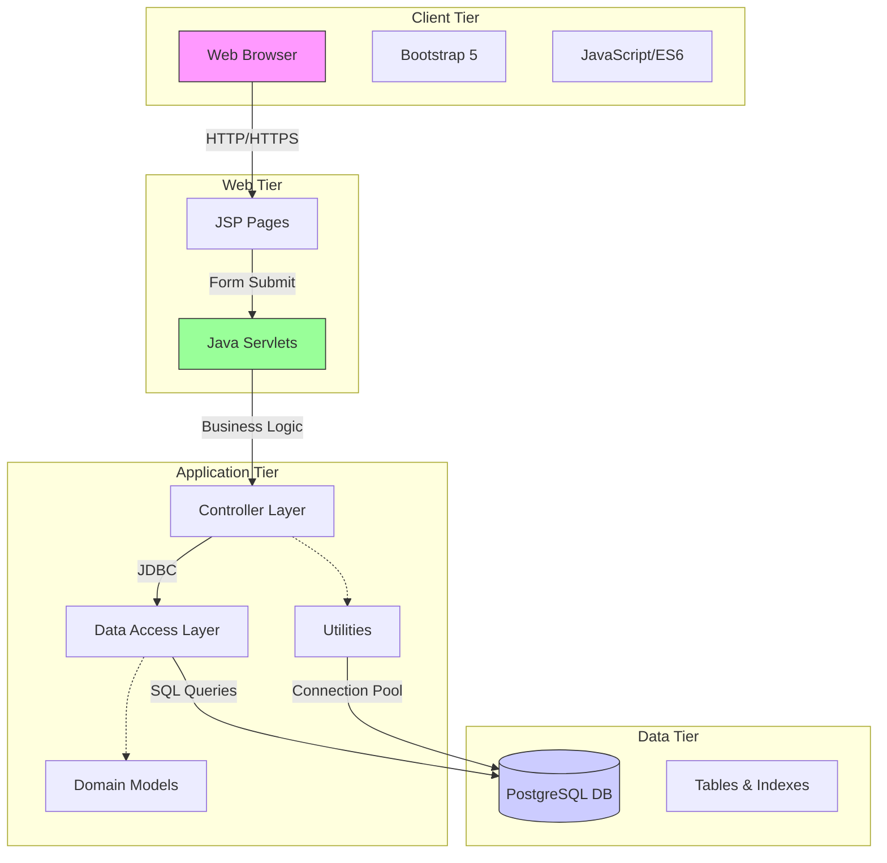
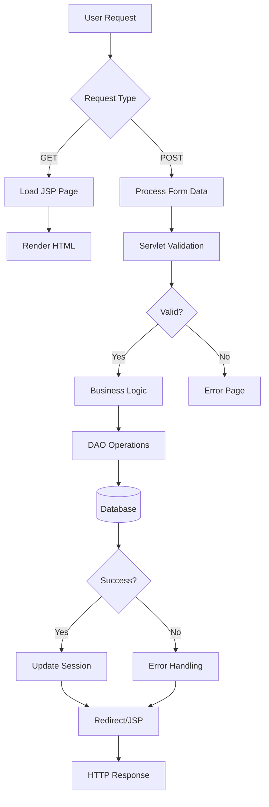
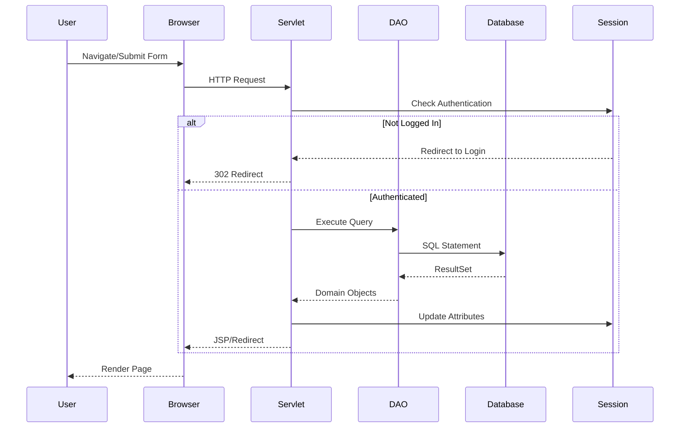

# VendorFlow - Complete Project Documentation

## 1. Project Overview

**VendorFlow** is a comprehensive **Smart Vendor Queue and Order Management System** designed to streamline operations for food vendors, cafeterias, and restaurants. It bridges the gap between customers and vendors by providing a seamless, real-time platform for ordering, queue tracking, and business analytics.

### Why It Was Built
Traditional food vendor operations in college campuses and cafeterias often face challenges:
- Long physical queues causing customer frustration
- Manual order tracking leading to errors
- No systematic way to manage vendor queues
- Lack of data-driven insights for vendors
- Inefficient communication between customers and vendors

### Main Objective
To digitize the ordering and queue management process, implementing a First-Come-First-Serve (FCFS) token system that automates order processing, provides real-time queue visibility, and offers actionable business analytics to vendors.

### Real-World Problem Solved
- **Eliminates Physical Queues**: Customers can browse menus, place orders, and get token numbers digitally
- **Reduces Wait Times**: Automated token generation and queue management
- **Improves Vendor Efficiency**: Real-time order tracking and status updates
- **Enhances Customer Experience**: Live order status tracking and feedback system
- **Data-Driven Decisions**: Analytics dashboard for sales trends and popular items

### Target Users
1. **Customers**: Browse menus, place orders, track tokens, provide feedback
2. **Vendors**: Manage menus, process orders, view queues, analyze sales
3. **Admins**: System oversight and management

### Key Features
- **Live Menu Browsing** with dynamic categories
- **Shopping Cart & Checkout** system
- **Real-time Queue Tracking** with FCFS token system
- **Token Status Updates** (Pending → Preparing → Ready → Completed)
- **Menu Management** (Add/Update/Delete/Toggle availability)
- **Order Status Management** for vendors
- **Customer Feedback & Rating System**
- **Sales Analytics & Insights** dashboards
- **Role-based Access Control** (Customer/Vendor/Admin)
- **Responsive Web Design** for all devices

---

## 2. SDG Alignment

This project aligns with the following UN Sustainable Development Goals:

### SDG 9: Industry, Innovation and Infrastructure
- **Target 9.1**: Develop quality, reliable, sustainable and resilient infrastructure
  - Digital infrastructure for food service industry
  - Cloud-based order management system
- **Target 9.2**: Promote inclusive and sustainable industrialization
  - Digitization of traditional food vendor businesses
  - Technology adoption in small-scale food enterprises
- **Target 9.3**: Increase access to financial services and markets
  - Digital payment infrastructure (foundation for future integration)
  - Market access through online presence

### SDG 11: Sustainable Cities and Communities
- **Target 11.3**: Enhance inclusive and sustainable urbanization
  - Digital solutions for campus/urban food services
  - Reduced congestion through digital queuing
- **Target 11.a**: Support positive economic, social and environmental links
  - Efficient resource utilization in food service
  - Reduced food waste through better demand prediction

### Additional Contributions
- **Decent Work and Economic Growth** (SDG 8): Enhanced business efficiency for small vendors
- **Responsible Consumption** (SDG 12): Better demand forecasting reduces waste
- **Quality Education** (SDG 4): Educational technology project demonstrating practical IT applications

---

## 3. Complete Folder Structure

```
VendorFlow/
├── .git/                          # Git repository metadata
├── .gitignore                     # Git ignore rules
├── .project                       # Eclipse project configuration
├── .settings/                     # Eclipse workspace settings
│   ├── org.eclipse.wst.common.component
│   ├── org.eclipse.wst.common.project.facet.core.xml
│   └── org.eclipse.jdt.core.prefs
├── .classpath                     # Eclipse classpath configuration
├── run_project.ps1                # PowerShell script for project deployment
├── vendorflow.sql                 # PostgreSQL database schema and seed data
├── sources.txt                    # List of Java source files for compilation
├── README.md                      # Project overview and setup guide
├── COMPLETE_DOCUMENTATION.md      # This comprehensive documentation
├── PROJECT_ARCHITECTURE.md        # Detailed architecture analysis
├── API_DOCUMENTATION.md           # Complete API documentation
├── DATABASE_DOCUMENTATION.md      # Database schema documentation
├── DEPLOYMENT_GUIDE.md            # Deployment instructions
├── FUTURE_SCOPE.md                # Future enhancement suggestions
├── WebContent/                    # Web application root
│   ├── index.jsp                  # Landing page
│   ├── login.jsp                  # Login page
│   ├── register.jsp               # Registration page
│   ├── css/
│   │   └── style.css              # Custom styles
│   ├── js/
│   │   ├── main.js                # Main JavaScript functions
│   │   └── validation.js          # Form validation logic
│   ├── customer/                  # Customer-facing pages
│   │   ├── dashboard.jsp          # Customer dashboard
│   │   ├── menu.jsp               # Menu browsing
│   │   ├── cart.jsp               # Shopping cart
│   │   ├── tokenStatus.jsp        # Token status tracking
│   │   └── history.jsp            # Order history
│   ├── vendor/                    # Vendor-facing pages
│   │   ├── dashboard.jsp          # Vendor dashboard
│   │   ├── queue.jsp              # Live order queue
│   │   ├── manageMenu.jsp         # Menu management
│   │   ├── orders.jsp             # Order history
│   │   ├── analytics.jsp          # Analytics dashboard
│   │   └── profile.jsp            # Vendor profile
│   ├── admin/                     # Admin pages
│   │   └── dashboard.jsp          # Admin dashboard
│   ├── common/                    # Shared components
│   │   ├── navbar.jsp             # Navigation bar
│   │   └── footer.jsp             # Footer component
│   └── WEB-INF/                   # Protected web resources
│       ├── web.xml                # Servlet configuration
│       ├── classes/               # Compiled Java classes
│       │   ├── controller/        # Servlet controllers
│       │   ├── dao/               # Data access objects
│       │   ├── model/             # Domain models
│       │   └── util/              # Utility classes
│       └── lib/                   # Java libraries
│           ├── gson-2.10.1.jar    # JSON processing
│           └── postgresql-42.7.3.jar  # PostgreSQL driver
└── src/                          # Java source code
    ├── controller/               # Servlet controllers
    │   ├── LoginServlet.java     # Authentication
    │   ├── RegisterServlet.java  # User registration
    │   ├── LogoutServlet.java    # Session termination
    │   ├── CartServlet.java      # Cart operations
    │   ├── PlaceOrderServlet.java    # Order placement
    │   ├── QueueServlet.java     # Queue management
    │   ├── OrderStatusServlet.java   # Status updates
    │   ├── AddMenuServlet.java   # Menu item creation
    │   ├── UpdateMenuServlet.java    # Menu item updates
    │   ├── DeleteMenuServlet.java    # Menu item deletion
    │   ├── FeedbackServlet.java  # Feedback submission
    │   └── AnalyticsServlet.java # Analytics data
    ├── dao/                      # Data Access Objects
    │   ├── UserDAO.java          # User operations
    │   ├── OrderDAO.java         # Order operations
    │   ├── MenuDAO.java          # Menu operations
    │   ├── FeedbackDAO.java      # Feedback operations
    │   └── AnalyticsDAO.java     # Analytics queries
    ├── model/                    # Domain models
    │   ├── User.java             # User entity
    │   ├── Order.java            # Order entity
    │   ├── OrderItem.java        # Order line item
    │   ├── MenuItem.java         # Menu item entity
    │   ├── CartItem.java         # Cart item
    │   └── Feedback.java         # Feedback entity
    └── util/                     # Utility classes
        ├── DBConnection.java     # Database connection
        ├── SessionUtil.java      # Session management
        └── TokenGenerator.java   # Token generation logic
```

### Entry Points
- **Web Application Entry**: `WebContent/index.jsp`
- **Authentication Entry**: `WebContent/login.jsp`
- **Main Servlet**: Various `@WebServlet` annotated servlets in `src/controller/`

### Configuration Files
1. **web.xml**: Servlet and web application configuration
2. **DBConnection.java**: Database connection settings
3. **run_project.ps1**: Automated deployment script
4. **vendorflow.sql**: Database schema and seed data

### Purpose of Key Directories
- **src/controller/**: Handles HTTP requests, business logic orchestration
- **src/dao/**: Database operations, CRUD functionality
- **src/model/**: Domain objects representing database entities
- **src/util/**: Reusable utility classes and helpers
- **WebContent/**: All web-accessible resources (JSP, CSS, JS)
- **WebContent/WEB-INF/**: Protected resources, not directly accessible
---

## 4. Technology Stack

### Backend Technologies
- **Java 11+**: Core programming language
  - *Why*: Platform independence, strong OOP support, enterprise-ready
  - *Advantages*: Mature ecosystem, excellent performance, vast libraries
  - *Alternatives*: Python (Django/Flask), Node.js, PHP

- **Java Servlets (javax.servlet)**: Web request handling
  - *Why*: Standard Java EE web component technology
  - *Advantages*: Portable, efficient, integration with application servers
  - *Alternatives*: Spring MVC, JAX-RS, Spark Java

- **JSP (JavaServer Pages)**: Server-side rendering
  - *Why*: Integration with Java backend, template rendering
  - *Advantages*: Direct Java code embedding, session management
  - *Alternatives*: Thymeleaf, FreeMarker, React/Vue.js frontend

### Frontend Technologies
- **HTML5**: Semantic markup structure
  - *Why*: Standard web markup language
  - *Advantages*: SEO-friendly, accessibility, cross-browser support

- **CSS3**: Styling and layout
  - *Why*: Visual presentation and responsive design
  - *Advantages*: Flexbox/Grid for modern layouts, animations
  - **Bootstrap 5.3.0**: CSS framework for rapid development
    - *Why*: Pre-built components, responsive grid system
    - *Advantages*: Consistency, mobile-first, extensive utilities

- **JavaScript (ES6)**: Client-side interactivity
  - *Why*: Dynamic behavior without page reloads
  - *Advantages*: Form validation, AJAX calls, DOM manipulation
  - **Bootstrap Icons**: Icon library for UI elements

### Database Technologies
- **PostgreSQL 42.7.3**: Primary database
  - *Why*: Advanced features, reliability, ACID compliance
  - **JDBC Driver**: Java database connectivity
  - *Advantages*: Open-source, JSON support, powerful querying
  - *Alternatives*: MySQL, MariaDB, SQLite (development)

### Build & Deployment
- **Apache Tomcat 9.x**: Servlet container
  - *Why*: Lightweight, widely adopted, Java EE compliant
  - *Advantages*: Easy deployment, good documentation
  - *Alternatives*: Jetty, WildFly, Spring Boot embedded server

- **JDK 11+**: Java Development Kit
  - *Why*: LTS version with long-term support
  - *Advantages*: Stable, performance optimizations

- **PowerShell Script**: Automated deployment
  - *Why*: Windows development environment
  - *Advantages*: Automation, compilation, deployment in one step

### Libraries & Dependencies
- **Gson 2.10.1**: JSON processing library
  - *Why*: Java object to JSON serialization/deserialization
  - *Use Case*: AJAX responses, API endpoints
  - *Advantages*: Simple API, Google maintained

- **PostgreSQL JDBC Driver**: Database connectivity
  - *Why*: Type 4 JDBC driver, pure Java implementation
  - *Advantages*: No native code required, efficient

---

## 5. Architecture Analysis

### Architecture Pattern
**Layered Architecture (n-tier)** with MVC pattern elements:

1. **Presentation Layer**: JSP pages, JavaScript, CSS
2. **Controller Layer**: Servlets handling HTTP requests
3. **Service/Business Layer**: Business logic (embedded in controllers/DAOs)
4. **Data Access Layer**: DAO classes for database operations
5. **Data Layer**: PostgreSQL database

### System Architecture Diagram



### Data Flow



### Component Interactions

1. **User Interaction**: Browser requests JSP page
2. **Authentication**: LoginServlet validates credentials via UserDAO
3. **Session Management**: SessionUtil stores user context
4. **Data Operations**: DAOs execute SQL via DBConnection
5. **Token Generation**: TokenGenerator queries for next token
6. **Order Processing**: PlaceOrderServlet orchestrates transaction
7. **Queue Management**: QueueServlet displays filtered orders
8. **Status Updates**: OrderStatusServlet modifies order state

### Request Flow



---

## 6. Frontend Analysis

### UI Structure
**JSP-based Server-Side Rendering** with Bootstrap 5 responsive framework

### Pages Overview

#### Customer Pages
1. **dashboard.jsp**: Main customer landing page
2. **menu.jsp**: Browse available menu items
3. **cart.jsp**: Shopping cart management
4. **tokenStatus.jsp**: Real-time token tracking
5. **history.jsp**: Past orders review

#### Vendor Pages
1. **dashboard.jsp**: Vendor main interface
2. **queue.jsp**: Live FCFS queue (auto-refresh every 15s)
3. **manageMenu.jsp**: CRUD for menu items
4. **orders.jsp**: Complete order history
5. **analytics.jsp**: Sales charts and insights
6. **profile.jsp**: Vendor profile management

#### Auth Pages
1. **login.jsp**: Authentication with role selection
2. **register.jsp**: New user registration

#### Admin Pages
1. **dashboard.jsp**: System administration

#### Shared Components
1. **navbar.jsp**: Navigation menu (role-aware)
2. **footer.jsp**: Common footer

### Component Hierarchy

```
WebContent/
├── Common Components (Reusable)
│   ├── Navbar (Dynamic based on role)
│   └── Footer
├── Customer Module
│   ├── Dashboard
│   ├── Menu Browser
│   ├── Cart Widget
│   ├── Token Tracker
│   └── History Viewer
├── Vendor Module
│   ├── Dashboard
│   ├── Queue Display (Auto-refresh)
│   ├── Menu Manager (CRUD)
│   ├── Order Manager
│   ├── Analytics
│   └── Profile
└── Auth Module
    ├── Login Form
    └── Registration Form
```

### State Management
- **Session Storage**: User data, cart items (server-side)
- **Request Attributes**: Page-specific data (JSP forwarding)
- **URL Parameters**: Filtering, sorting, status indicators
- **No Client-Side State Framework**: Traditional JSP model

### Routing
**Server-Side Routing** via Servlet mappings:

```
/LoginServlet              → Login authentication
/RegisterServlet           → User registration
/LogoutServlet             → Session invalidation
/CartServlet               → Cart operations
/PlaceOrderServlet         → Order creation
/QueueServlet              → Queue display
/OrderStatusServlet        → Status updates
/AddMenuServlet            → Menu item creation
/UpdateMenuServlet         → Menu item updates
/DeleteMenuServlet         → Menu item deletion
/FeedbackServlet           → Feedback submission
/AnalyticsServlet          → Analytics data
```

**JSP Navigation**: Direct page access with servlet guards

### Form Validations

#### Client-Side (JavaScript)
- **validation.js**: Input validation rules
- **main.js**: General utility functions
- Features:
  - Required field checks
  - Email format validation
  - Password strength
  - Phone number format
  - Real-time feedback

#### Server-Side (Servlet)
- Null/Empty checks
- Role validation
- Session validation
- SQL injection prevention (PreparedStatement)
- Data type validation
- Business rule enforcement

### Responsiveness
- **Bootstrap 5 Grid System**: Mobile-first approach
- **Breakpoints**: xs, sm, md, lg, xl
- **Flexible Components**: Cards, buttons, forms
- **Viewport Meta Tag**: Proper mobile scaling
- **Test Coverage**: Desktop, tablet, mobile layouts

### Styling System

#### Global Styles (css/style.css)
- Custom color variables
- Component overrides
- Utility classes
- Animations and transitions

#### Component Styles
- Inline styles for dynamic elements
- Bootstrap utility classes
- Context-specific styling
- Icon integration (Bootstrap Icons)

#### Design Tokens
- Primary color: Blue-based theme
- Consistent spacing (Bootstrap spacing scale)
- Typography: Bootstrap defaults
- Border radius: Consistent rounding
- Shadows: Depth indicators

---

## 7. Backend Analysis

### Controllers (Servlet Layer)

#### LoginServlet.java
- **Responsibility**: User authentication
- **Methods**: 
  - `doGet()`: Display login form
  - `doPost()`: Process credentials
- **Flow**: Validate → Create Session → Redirect by role
- **Security**: Session creation, role-based redirects

#### RegisterServlet.java
- **Responsibility**: New user registration
- **Validation**: Email uniqueness, required fields
- **DAO Integration**: UserDAO.registerUser()
- **Security**: Password handling (plain text - ⚠️ security concern)

#### LogoutServlet.java
- **Responsibility**: Session termination
- **Function**: Invalidate session, clear attributes
- **Security**: Proper session cleanup

#### CartServlet.java
- **Responsibility**: Shopping cart operations
- **Session-based**: Cart stored in HttpSession
- **Operations**: Add, update, remove, clear

#### PlaceOrderServlet.java
- **Responsibility**: Order placement workflow
- **Operations**:
  1. Validate customer session
  2. Retrieve cart from session
  3. Calculate total
  4. Generate token (TokenGenerator)
  5. Create order (OrderDAO.placeOrder)
  6. Clear cart
  7. Redirect to token status
- **Transaction**: ACID compliance (commit/rollback)

#### QueueServlet.java
- **Responsibility**: Vendor queue display
- **Filter**: Vendor role required
- **Data**: Today's non-completed orders (FCFS)
- **Auto-refresh**: Meta refresh 15s (JSP level)

#### OrderStatusServlet.java
- **Responsibility**: Order lifecycle management
- **Status Flow**: Pending → Preparing → Ready → Completed
- **DAO**: OrderDAO.updateOrderStatus()
- **Security**: Vendor authorization

#### AddMenuServlet.java
- **Responsibility**: Create new menu items
- **Validation**: Required fields, price format
- **DAO**: MenuDAO.addItem()

#### UpdateMenuServlet.java
- **Responsibility**: Modify existing menu items
- **Operations**: Name, price, description, availability
- **DAO**: MenuDAO.updateItem()

#### DeleteMenuServlet.java
- **Responsibility**: Soft/hard delete menu items
- **Consideration**: FK constraints (order_items references)

#### FeedbackServlet.java
- **Responsibility**: Customer feedback submission
- **Validation**: Rating range (1-5), order association
- **DAO**: FeedbackDAO.addFeedback()

#### AnalyticsServlet.java
- **Responsibility**: Analytics data provision
- **Data**: Sales, popular items, revenue
- **Format**: JSON (via Gson)
- **DAO**: AnalyticsDAO queries

### Services (Business Logic)
**Embedded in Controllers** (no separate service layer)
- Order total calculation
- Token generation
- Cart management
- Validation logic
- Transaction coordination

### Repositories (DAO Layer)

#### UserDAO.java
- **Operations**: CRUD for users table
- **Methods**:
  - `registerUser()`: INSERT with RETURNING
  - `loginUser()`: Authenticate by email/password/role
  - `emailExists()`: Uniqueness check
  - `getUserById()`: Retrieve by ID
  - `updateProfile()`: Vendor profile updates
- **Security**: Password stored as plain text (⚠️)

#### OrderDAO.java
- **Operations**: Complex order management
- **Methods**:
  - `placeOrder()`: Transaction with order + items + payment
  - `getOrdersByCustomer()`: Customer order history
  - `getVendorQueue()`: Today's active orders (FCFS)
  - `getAllOrdersForVendor()`: Complete order history
  - `updateOrderStatus()`: Status transitions
  - `getOrderById()`: Full order with items
  - `getTokenStatus()`: Customer token tracking
- **Features**: JOIN queries, batch inserts, transactions

#### MenuDAO.java
- **Operations**: MenuItem management
- **Methods**:
  - `getMenuByVendor()`: Vendor-specific menu
  - `addItem()`: Create menu item
  - `updateItem()`: Modify item
  - `deleteItem()`: Remove item
  - `toggleAvailability()`: Stock control

#### FeedbackDAO.java
- **Operations**: Customer feedback
- **Methods**:
  - `addFeedback()`: Submit rating/comments
  - `getFeedbackByVendor()`: Vendor reviews
  - `getFeedbackByOrder()`: Specific order feedback

#### AnalyticsDAO.java
- **Operations**: Reporting queries
- **Methods**:
  - `getDailyRevenue()`: Revenue by date
  - `getPopularItems()`: Sales ranking
  - `getOrderStats()`: Vendor statistics
  - `getCustomerInsights()`: Customer analytics

### Business Logic Details

#### Token Generation Algorithm
```
1. Receive vendorId parameter
2. Query: SELECT COALESCE(MAX(token_number), 0) + 1 
   FROM orders 
   WHERE vendor_id = ? 
   AND DATE(created_at) = CURRENT_DATE
3. Execute query with vendorId
4. Return result (next token number)
5. Fallback: Return 1 if error
```

**Properties**:
- Daily reset at midnight (CURRENT_DATE)
- Per-vendor sequence
- FCFS guarantee via unique index
- Thread-safe (database-level locking)

#### Order Placement Workflow
```
1. Begin transaction (conn.setAutoCommit(false))
2. Insert order header → Get order_id
3. Batch insert order_items
4. Insert payment record (Cash, Pending)
5. Commit transaction
6. On error: Rollback, return -1
7. Finally: Reset auto-commit, close connection
```

### Security Implementation

#### Authentication
- Session-based authentication
- Role-based access control (RBAC)
- Session attributes: userId, userName, userRole, userEmail
- Servlet guards: SessionUtil.requireRole()

#### Authorization
- Role checks in each servlet
- Menu-level security (navbar shows appropriate options)
- Page-level redirects for unauthorized access
- Vendor-specific data isolation (WHERE vendor_id = ?)

#### Input Validation
- Server-side validation in all servlets
- Null checks for all parameters
- SQL injection prevention (PreparedStatement)
- XSS prevention (JSP expression escaping)

#### Session Management
- Session timeout: 30 minutes (web.xml)
- HttpSession for user context
- Proper invalidation on logout
- Session fixation prevention (new session on login)

### Error Handling
- SQLException caught and logged
- User-friendly error messages
- Redirect to error pages with context
- Transaction rollback on failure
- Connection cleanup in finally blocks
- Stack traces logged to stderr

---

