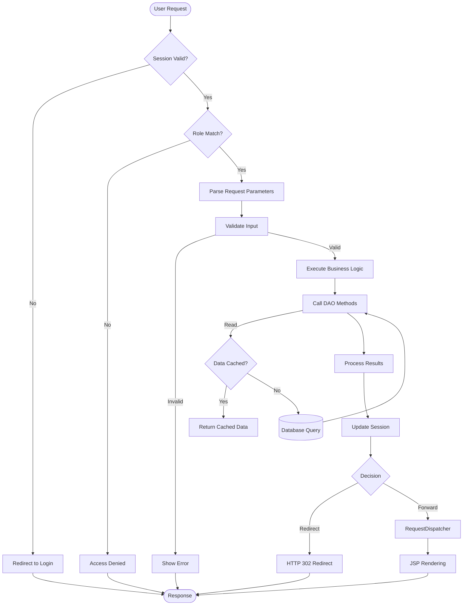
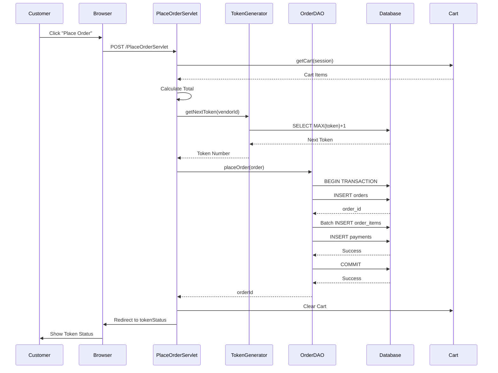
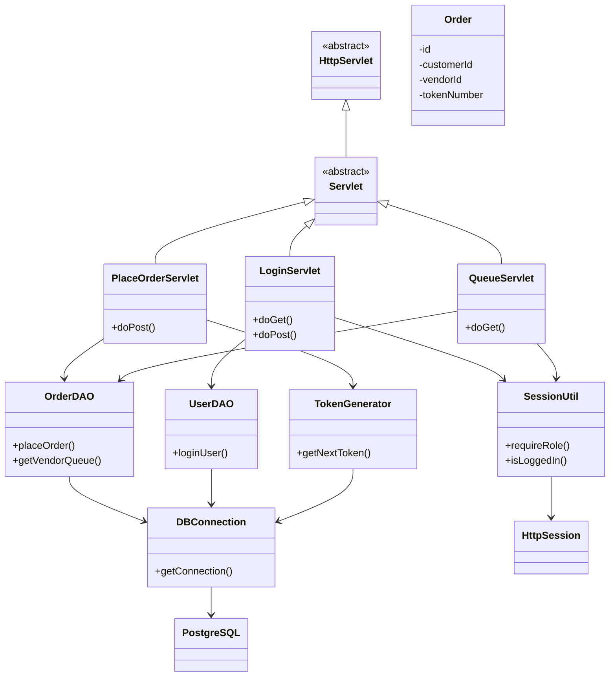

# VendorFlow - Project Architecture Documentation

## 1. Architecture Pattern: Layered MVC Architecture

### Overview
VendorFlow implements a **Layered Architecture** with MVC (Model-View-Controller) pattern elements:

```
┌─────────────────────────────────────────────────────────────┐
│                    Presentation Layer                        │
│  ┌─────────────┐  ┌─────────────┐  ┌─────────────────┐   │
│  │   JSP View  │  │   JSP View  │  │   JSP View      │   │
│  │ (customer)  │  │   (vendor)  │  │   (admin)       │   │
│  └─────────────┘  └─────────────┘  └─────────────────┘   │
└─────────────────┬──────────────────┬───────────────────────┘
                  │                  │
┌─────────────────▼──────────────────▼───────────────────────┐
│                   Controller Layer                          │
│  ┌─────────────┐  ┌─────────────┐  ┌─────────────────┐   │
│  │  Servlets   │  │  Servlets   │  │     Servlets    │   │
│  │ (Customer)  │  │  (Vendor)   │  │    (General)    │   │
│  └─────────────┘  └─────────────┘  └─────────────────┘   │
└─────────────────┬──────────────────┬───────────────────────┘
                  │                  │
┌─────────────────▼──────────────────▼───────────────────────┐
│                   Business Logic Layer                      │
│  ┌─────────────┐  ┌─────────────┐  ┌─────────────────┐   │
│  │  Token      │  │  Cart       │  │  Validation     │   │
│  │  Generation │  │  Management  │  │  Logic          │   │
│  └─────────────┘  └─────────────┘  └─────────────────┘   │
└─────────────────┬──────────────────┬───────────────────────┘
                  │                  │
┌─────────────────▼──────────────────▼───────────────────────┐
│                    Data Access Layer                        │
│  ┌─────────────┐  ┌─────────────┐  ┌─────────────────┐   │
│  │   UserDAO   │  │  OrderDAO   │  │   MenuDAO       │   │
│  └─────────────┘  └─────────────┘  └─────────────────┘   │
└─────────────────┬──────────────────┬───────────────────────┘
                  │                  │
┌─────────────────▼──────────────────▼───────────────────────┐
│                      Data Layer                             │
│  ┌─────────────────────────────────────────────────────┐   │
│  │                PostgreSQL Database                    │   │
│  │  ┌───────────┐  ┌───────────┐  ┌─────────────────┐ │   │
│  │  │  users    │  │  orders   │  │  menu_items     │ │   │
│  │  └───────────┘  └───────────┘  └─────────────────┘ │   │
│  └─────────────────────────────────────────────────────┘   │
└─────────────────────────────────────────────────────────────┘
```

## 2. Component Interactions

### 2.1 Request Processing Flow



### 2.2 Order Placement Sequence



### 2.3 Queue Management Flow

```mermaid
flowchart LR
    A[Vendor Dashboard] -->|Navigate| B[QueueServlet]
    B --> C[Check Vendor Session]
    C -->|Valid| D[Get Vendor ID]
    C -->|Invalid| E[Redirect to Login]
    D --> F[OrderDAO.getVendorQueue]
    F --> G[SELECT orders WHERE vendor_id=? AND status IN (Pending,Preparing,Ready) AND DATE=today ORDER BY token_number]
    G --> H[Database Query]
    H --> I[Build Order Objects]
    I --> J[Set Request Attribute]
    J --> K[Forward to queue.jsp]
    K --> L[Render Queue Page]
    L --> M[Auto-refresh Meta: 15s]
    M -->|Refresh| B
```

## 3. Data Flow Patterns

### 3.1 Read Operation Flow
```
1. User requests page (e.g., View Menu)
2. Servlet checks session validity
3. Servlet calls appropriate DAO method
4. DAO creates PreparedStatement
5. Execute SQL SELECT query
6. Iterate ResultSet, create Model objects
7. Return collection to Servlet
8. Servlet sets request attribute
9. Forward to JSP
10. JSP renders HTML using model data
```

### 3.2 Write Operation Flow
```
1. User submits form
2. Servlet validates parameters
3. Servlet creates Model object
4. Servlet calls DAO method
5. DAO gets Connection from pool
6. Set autoCommit = false
7. Execute INSERT/UPDATE
8. If successful: commit()
9. If error: rollback()
10. Reset autoCommit = true
11. Close resources
12. Return result to Servlet
13. Update session if needed
14. Redirect to prevent duplicate submission
```

## 4. Key Design Decisions

### 4.1 Transaction Management
**Decision**: Use JDBC transactions for order placement
**Rationale**: Ensure atomicity of order creation (order header + items + payment)
**Implementation**: 
- Manual commit/rollback control
- Try-catch-finally pattern
- Resource cleanup in finally block

### 4.2 Token Generation Strategy
**Decision**: Database-level sequence per vendor per day
**Rationale**: 
- Prevents race conditions
- Ensures FCFS ordering
- Handles concurrent order placement
- Daily reset for manageability

**Implementation**:
```sql
SELECT COALESCE(MAX(token_number), 0) + 1 
FROM orders 
WHERE vendor_id = ? 
  AND DATE(created_at) = CURRENT_DATE;
```

### 4.3 Session Management
**Decision**: Server-side HttpSession with role attributes
**Rationale**: 
- Secure credential storage
- Simple implementation
- Automatic timeout handling
- Standard Java EE pattern

**Session Attributes**:
- `userId`: Integer
- `userName`: String
- `userRole`: String (customer/vendor/admin)
- `userEmail`: String
- `vendorId`: Integer (vendors only)

### 4.4 Layer Separation
**Decision**: Thin service layer, logic in controllers
**Rationale**: 
- Small project scope
- Rapid development
- Simpler debugging
- Trade-off: Less reusable business logic

**Future Consideration**: Extract business logic to service layer for larger scale

## 5. Component Dependencies

### 5.1 Class Dependency Graph



### 5.2 Package Dependencies

```
controller
    ↓ (uses)
dao
    ↓ (uses)
util
    ↓ (uses)
PostgreSQL JDBC Driver
    ↓ (implements)
SQL Standards
```

## 6. Database Schema Design

### 6.1 Entity-Relationship Overview

```mermaid
erDiagram
    USERS ||--o{ ORDERS : places
    USERS ||--o{ MENU_ITEMS : manages
    ORDERS ||--|{ ORDER_ITEMS : contains
    MENU_ITEMS ||--|{ ORDER_ITEMS : included in
    ORDERS ||--|| PAYMENTS : has
    USERS ||--o{ FEEDBACK : provides
    ORDERS ||--|{ FEEDBACK : receives
    
    USERS {
        int id PK
        string name
        string email UK
        string password
        string phone
        string role
        string shop_name
        string shop_address
        timestamp created_at
    }
    
    MENU_ITEMS {
        int id PK
        int vendor_id FK
        string name
        text description
        decimal price
        string category
        boolean is_available
        timestamp created_at
    }
    
    ORDERS {
        int id PK
        int customer_id FK
        int vendor_id FK
        int token_number
        decimal total_amount
        string status
        text special_notes
        timestamp created_at
        timestamp updated_at
    }
    
    ORDER_ITEMS {
        int id PK
        int order_id FK
        int menu_item_id FK
        int quantity
        decimal unit_price
        decimal subtotal (generated)
    }
    
    PAYMENTS {
        int id PK
        int order_id FK UK
        decimal amount
        string payment_method
        string payment_status
        timestamp paid_at
    }
    
    FEEDBACK {
        int id PK
        int customer_id FK
        int vendor_id FK
        int order_id FK
        int rating
        text comments
        timestamp created_at
    }
```

## 7. Performance Considerations

### 7.1 Query Optimization
- **Indexes**: Unique index on (vendor_id, token_number, date)
- **JOINs**: Use INNER JOIN for required relationships
- **Batch Operations**: Batch insert for order items
- **Connection Pooling**: Not implemented (potential bottleneck)

### 7.2 Caching Strategy
- **Current**: No caching layer
- **Opportunity**: Cache menu items, vendor info
- **Benefit**: Reduce database load for frequently accessed data

### 7.3 Concurrency Handling
- **Token Generation**: Database-level locking
- **Order Placement**: Transaction isolation
- **Status Updates**: Last-write-wins (acceptable for this use case)

## 8. Scalability Analysis

### 8.1 Current Limitations
1. **No Connection Pooling**: Creates new connection per request
2. **Session Replication**: Not configured for cluster
3. **No Caching Layer**: All queries hit database
4. **Vertical Scaling Only**: Single Tomcat instance

### 8.2 Scalability Improvements
1. Add connection pool (HikariCP)
2. Implement Redis for session/cache
3. Add load balancer for multiple Tomcat instances
4. Separate read/write databases
5. Add message queue for async operations

## 9. Security Architecture

### 9.1 Defense in Depth
```
┌─────────────────────────────────────────────────────────────────┐
│                        Network Layer                             │
│  ┌─────────────────────┐  ┌─────────────────────────────────┐  │
│  │  Firewall Rules     │  │  HTTPS/TLS (Future Enhancement) │  │
│  └─────────────────────┘  └─────────────────────────────────┘  │
└─────────────────┬───────────────────────────────────────────────┘
                  │
┌─────────────────▼───────────────────────────────────────────────┐
│                      Application Layer                           │
│  ┌─────────────────────┐  ┌─────────────────────────────────┐  │
│  │  Session Management │  │  Authentication & Authorization  │  │
│  │  (HttpSession)      │  │  (Role-based Access Control)    │  │
│  └─────────────────────┘  └─────────────────────────────────┘  │
└─────────────────┬───────────────────────────────────────────────┘
                  │
┌─────────────────▼───────────────────────────────────────────────┐
│                      Data Validation Layer                       │
│  ┌─────────────────────┐  ┌─────────────────────────────────┐  │
│  │  Input Validation   │  │  SQL Injection Prevention       │  │
│  │  (Server-side)      │  │  (PreparedStatements)          │  │
│  └─────────────────────┘  └─────────────────────────────────┘  │
└─────────────────┬───────────────────────────────────────────────┘
                  │
┌─────────────────▼───────────────────────────────────────────────┐
│                      Database Layer                              │
│  ┌─────────────────────┐  ┌─────────────────────────────────┐  │
│  │  PostgreSQL         │  │  Constraints & Triggers         │  │
│  │  Security           │  │  (CHECK, FK, UNIQUE)            │  │
│  └─────────────────────┘  └─────────────────────────────────┘  │
└─────────────────────────────────────────────────────────────────┘
```

### 9.2 Security Controls
1. **Authentication**: Session-based with role verification
2. **Authorization**: Servlet-level role checks
3. **Input Validation**: Server-side parameter validation
4. **SQL Injection Prevention**: PreparedStatement usage
5. **Session Security**: Timeout, invalidation on logout
6. **Data Integrity**: Database constraints, foreign keys
7. **Audit Trail**: Timestamps on all records

### 9.3 Identified Vulnerabilities
- ⚠️ Passwords stored in plaintext
- ⚠️ No HTTPS/TLS encryption
- ⚠️ No CSRF token protection
- ⚠️ Session fixation possible (mitigated by new session on login)
- ⚠️ XSS vulnerability if user input not escaped
- ⚠️ No rate limiting on authentication endpoints

## 10. Error Handling Strategy

### 10.1 Exception Hierarchy
```
Throwable
  ├── Error (System errors)
  └── Exception
       ├── SQLException (Database errors)
       ├── ServletException (Servlet errors)
       └── IOException (I/O errors)
```

### 10.2 Error Handling Pattern
```java
try {
    // Business logic
} catch (SQLException e) {
    // Log error
    System.err.println("[Component] Error: " + e.getMessage());
    // Rollback transaction
    try { if (conn != null) conn.rollback(); } catch (SQLException ex) {}
    // Return error indicator
    return -1;
} finally {
    // Cleanup resources
    try { if (conn != null) conn.close(); } catch (SQLException ex) {}
}
```

### 10.3 User Feedback
- Error messages stored in request attributes
- Displayed in JSP via conditional rendering
- Multilingual support not implemented
- Generic messages for security (no stack traces)

## 11. Deployment Architecture

### 11.1 Current Setup
```
Windows Development Environment
├── Eclipse IDE
├── Apache Tomcat 9.x
├── PostgreSQL Database
└── Project Workspace
    └── VendorFlow (Dynamic Web Project)
```

### 11.2 Production Deployment Pattern
```
Load Balancer (Optional)
    │
    ▼
┌─────────────────────┐
│   Tomcat Server     │
│  (Multiple Inst.)   │
└────────────────┬────┘
                 │
┌────────────────▼─────────┐
│    Connection Pool        │
│   (HikariCP - Future)     │
└────────────────┬─────────┘
                 │
┌────────────────▼─────────┐
│    PostgreSQL Cluster     │
│   (Primary-Replica)       │
└───────────────────────────┘
```

## 12. Conclusion

VendorFlow's architecture demonstrates solid foundational design with:
- Clean separation of concerns (MVC pattern)
- Transactional integrity for critical operations
- Role-based access control
- Scalable database design with proper indexing

**Areas for Enhancement**:
1. Extract business logic to dedicated service layer
2. Implement connection pooling
3. Add caching mechanism
4. Enhance security (password hashing, HTTPS)
5. Add API layer for mobile/SPA clients
6. Implement proper logging framework
7. Add comprehensive unit/integration tests

The architecture provides a maintainable foundation that can evolve to meet growing requirements while preserving core functionality and data integrity.

---
*Last Updated: 2026-05-07*
